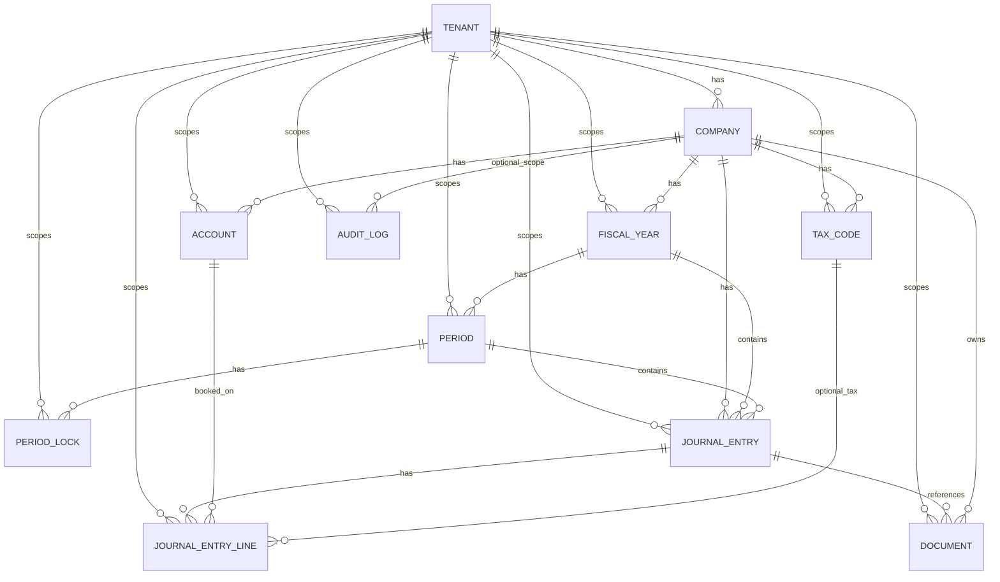

# Datenmodell v0 – Review-Dokument

## Übersicht
Das v0-Datenmodell bildet die Kernentitäten für Mandantenfähigkeit, Stammdaten,
Buchungssätze, Belegreferenzen und Auditierbarkeit ab.

## ER-Diagramm (Mermaid)

## Feldübersicht (Kernauszug)

### Tenant
- `id` (PK)
- `name` (unique)
- `created_at`

### Company
- `id` (PK)
- `tenant_id` (FK → `tenant.id`)
- `name`
- `currency_code`
- `created_at`
- Constraint: `UNIQUE(tenant_id, name)`

### FiscalYear
- `id` (PK)
- `tenant_id` (FK → `tenant.id`)
- `company_id` (FK → `company.id`)
- `label`, `start_date`, `end_date`, `is_closed`
- Constraints: `UNIQUE(company_id, label)`, `start_date < end_date`

### Period
- `id` (PK)
- `tenant_id` (FK → `tenant.id`)
- `fiscal_year_id` (FK → `fiscal_year.id`)
- `period_number`, `start_date`, `end_date`, `status`
- Constraints: `UNIQUE(fiscal_year_id, period_number)`, `period_number BETWEEN 1 AND 13`

### PeriodLock
- `id` (PK)
- `tenant_id` (FK → `tenant.id`)
- `period_id` (FK → `period.id`)
- `locked_at`, `reason`, `locked_by`

### Account
- `id` (PK)
- `tenant_id` (FK → `tenant.id`)
- `company_id` (FK → `company.id`)
- `code`, `name`, `account_type`, `is_active`
- Constraint: `UNIQUE(company_id, code)`

### TaxCode
- `id` (PK)
- `tenant_id` (FK → `tenant.id`)
- `company_id` (FK → `company.id`)
- `code`, `rate`, `description`, `is_active`
- Constraints: `UNIQUE(company_id, code)`, `rate >= 0`

### JournalEntry
- `id` (PK)
- `tenant_id`, `company_id`, `fiscal_year_id`, `period_id` (FKs)
- `posting_number`, `entry_date`, `description`, `source`, `created_at`
- Constraint: `UNIQUE(company_id, posting_number)`

### JournalEntryLine
- `id` (PK)
- `tenant_id`, `journal_entry_id`, `account_id` (FKs), `tax_code_id` (optional FK)
- `line_number`, `description`, `debit_amount`, `credit_amount`, `currency_code`
- Constraints:
  - `UNIQUE(journal_entry_id, line_number)`
  - `debit_amount >= 0`
  - `credit_amount >= 0`
  - genau eine Seite ist größer 0 (Soll/Haben-Integrität)

### Document
- `id` (PK)
- `tenant_id`, `company_id` (FKs), `journal_entry_id` (optionale FK)
- `file_name`, `storage_key`, `mime_type`, `uploaded_at`

### AuditLog
- `id` (PK)
- `tenant_id` (FK), `company_id` (optionale FK)
- `entity_type`, `entity_id`, `action`, `payload`, `changed_by`, `changed_at`
