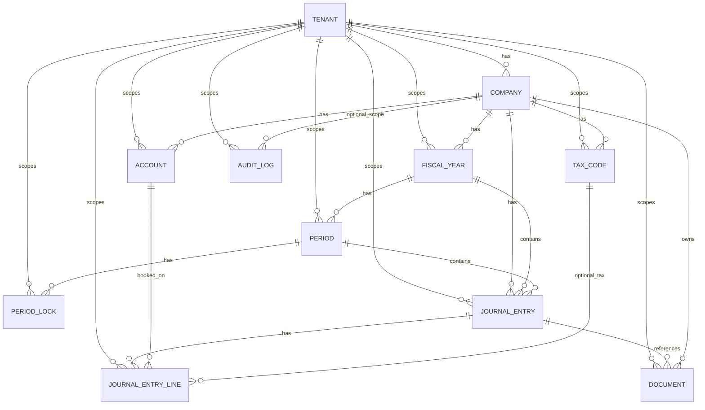

# Datenmodell v0 – Review-Dokument

## Zweck und Abgrenzung
Dieser Entwurf konkretisiert den MVP-Domänenkern für die Umsetzungsplanung und leitet sich aus
ADR-001 („Modularer Monolith mit Schichten“) ab. Schwerpunkt sind die Entitäten,
Kernrelationen und Integritätsregeln für den Basis-Buchungsflow.

**Verknüpfte Architekturentscheidung:** `docs/adr/ADR-001-monolith-modulare-schichten.md`

## MVP-Domänenkern (P1-000 Scope)
- `Tenant`
- `Company`
- `Account`
- `JournalEntry`
- `JournalEntryLine`
- `TaxCode`
- `Document`

Alle oben genannten Entitäten sind als SQLAlchemy-Modelle und Migrationen im v0 enthalten.

## ER-Diagramm (Mermaid)

## Entitäten, Relationen und Kernregeln (MVP-fokussiert)

### Tenant
- Zweck: Technischer/fachlicher Isolationsanker für Mandantenfähigkeit.
- Kernrelationen: `Tenant 1:n Company`, `Tenant 1:n Account`, `Tenant 1:n JournalEntry`.
- Regel:
  - Jede fachlich relevante Tabelle führt `tenant_id`.
  - Tenant-übergreifende Referenzen sind unzulässig.

### Company
- Zweck: Buchhaltungseinheit je Gesellschaft innerhalb eines Mandanten.
- Kernrelationen: `Company 1:n Account`, `Company 1:n TaxCode`, `Company 1:n JournalEntry`,
  `Company 1:n Document`.
- Regeln:
  - `UNIQUE(tenant_id, name)` verhindert doppelte Gesellschaftsnamen im selben Mandanten.
  - `currency_code` ist Pflicht und bestimmt die Buchungswährung für MVP-Standardfälle.

### Account
- Zweck: Kontenstamm für Soll/Haben-Buchungen.
- Kernrelation: `Account 1:n JournalEntryLine`.
- Regeln:
  - `UNIQUE(company_id, code)`.
  - Nur aktive Konten (`is_active = true`) dürfen neu bebucht werden.
  - Account gehört zum selben `tenant_id` und `company_id` wie die Buchungszeile.

### TaxCode
- Zweck: Steuerkennzeichen für Buchungszeilen.
- Kernrelation: `TaxCode 1:n JournalEntryLine` (optional).
- Regeln:
  - `UNIQUE(company_id, code)`.
  - `rate >= 0`.
  - Wenn gesetzt, muss der `TaxCode` zur selben Company wie die Buchungszeile gehören.

### JournalEntry
- Zweck: Buchungskopf mit fachlichem Kontext.
- Kernrelationen: `JournalEntry 1:n JournalEntryLine`, `JournalEntry 1:n Document` (Referenz).
- Regeln:
  - `UNIQUE(company_id, posting_number)`.
  - Ein JournalEntry ist nur gültig, wenn mindestens zwei Lines vorhanden sind.
  - Summe Soll = Summe Haben über alle Lines (Buchungssatz-Invariante).

### JournalEntryLine
- Zweck: Einzelne Soll/Haben-Zeile.
- Regeln:
  - `UNIQUE(journal_entry_id, line_number)`.
  - `debit_amount >= 0`, `credit_amount >= 0`.
  - Genau eine Seite darf > 0 sein (XOR-Regel).
  - `account_id` ist Pflicht; `tax_code_id` optional.

### Document
- Zweck: Belegmetadaten und Verknüpfung zum Buchungskontext.
- Kernrelationen: `Company 1:n Document`, optional `JournalEntry 1:n Document`.
- Regeln:
  - `UNIQUE(tenant_id, storage_key)` verhindert doppelte Ablage-Keys pro Tenant.
  - Verknüpfter `journal_entry_id` muss zur selben Company/Tenant gehören.

## Feldübersicht (Kernauszug)

### Tenant
- `id` (PK)
- `name` (unique)
- `created_at`

### Company
- `id` (PK)
- `tenant_id` (FK → `tenant.id`)
- `name`
- `currency_code`
- `created_at`
- Constraint: `UNIQUE(tenant_id, name)`

### FiscalYear
- `id` (PK)
- `tenant_id` (FK → `tenant.id`)
- `company_id` (FK → `company.id`)
- `label`, `start_date`, `end_date`, `is_closed`
- Constraints: `UNIQUE(company_id, label)`, `start_date < end_date`

### Period
- `id` (PK)
- `tenant_id` (FK → `tenant.id`)
- `fiscal_year_id` (FK → `fiscal_year.id`)
- `period_number`, `start_date`, `end_date`, `status`
- Constraints: `UNIQUE(fiscal_year_id, period_number)`, `period_number BETWEEN 1 AND 13`

### PeriodLock
- `id` (PK)
- `tenant_id` (FK → `tenant.id`)
- `period_id` (FK → `period.id`)
- `locked_at`, `reason`, `locked_by`

### Account
- `id` (PK)
- `tenant_id` (FK → `tenant.id`)
- `company_id` (FK → `company.id`)
- `code`, `name`, `account_type`, `is_active`
- Constraint: `UNIQUE(company_id, code)`

### TaxCode
- `id` (PK)
- `tenant_id` (FK → `tenant.id`)
- `company_id` (FK → `company.id`)
- `code`, `rate`, `description`, `is_active`
- Constraints: `UNIQUE(company_id, code)`, `rate >= 0`

### JournalEntry
- `id` (PK)
- `tenant_id`, `company_id`, `fiscal_year_id`, `period_id` (FKs)
- `posting_number`, `entry_date`, `description`, `source`, `created_at`
- Constraint: `UNIQUE(company_id, posting_number)`

### JournalEntryLine
- `id` (PK)
- `tenant_id`, `journal_entry_id`, `account_id` (FKs), `tax_code_id` (optional FK)
- `line_number`, `description`, `debit_amount`, `credit_amount`, `currency_code`
- Constraints:
  - `UNIQUE(journal_entry_id, line_number)`
  - `debit_amount >= 0`
  - `credit_amount >= 0`
  - genau eine Seite ist größer 0 (Soll/Haben-Integrität)

### Document
- `id` (PK)
- `tenant_id`, `company_id` (FKs), `journal_entry_id` (optionale FK)
- `file_name`, `storage_key`, `mime_type`, `uploaded_at`
- Constraint: `UNIQUE(tenant_id, storage_key)`

### AuditLog
- `id` (PK)
- `tenant_id` (FK), `company_id` (optionale FK)
- `entity_type`, `entity_id`, `action`, `payload`, `changed_by`, `changed_at`

## Entscheidungsbedarf (Folgeentscheidungen)
1. **D-001:** Präzise Lebenszyklus-Regel für `JournalEntry` (Draft vs. Posted) und Unveränderbarkeit
   nach Festschreibung final entscheiden.
2. **D-002:** Steuerlogik-Schnittstelle definieren: bleibt `TaxCode` rein satzbasiert oder wird ein
   separates Tax-Detail-Modell für komplexere USt-Fälle benötigt?
3. **D-003:** Dokumentablage-Strategie festlegen (lokales FS vs. S3-kompatibel) inkl.
   Anforderungen an Revisionssicherheit.
4. **D-004:** Umgang mit Fremdwährungen im MVP entscheiden (`currency_code` je Line vs. nur Company-Währung).

## Ableitbare Sprint-Arbeitspakete (für P1-001 ff.)
- SQLAlchemy-Modelle für MVP-Kernentitäten (`Tenant` bis `Document`) priorisiert umsetzen.
- Validierungslogik für JournalEntry/Lines als Domain-Service mit automatisierten Tests.
- Tenant/Company-Scoping als wiederverwendbare Query-Policy implementieren.
- Minimalen Document-Link-Flow im vertikalen Prototyp vorbereiten.
